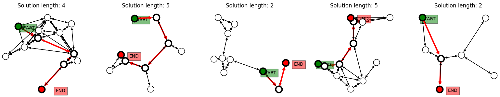
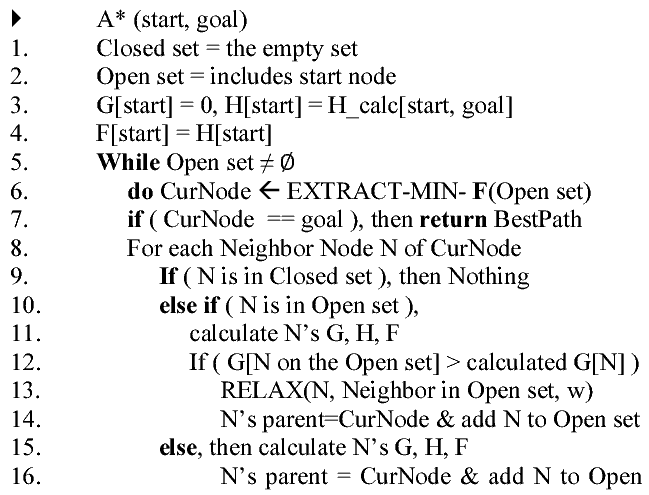
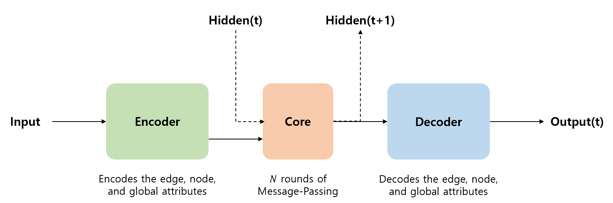
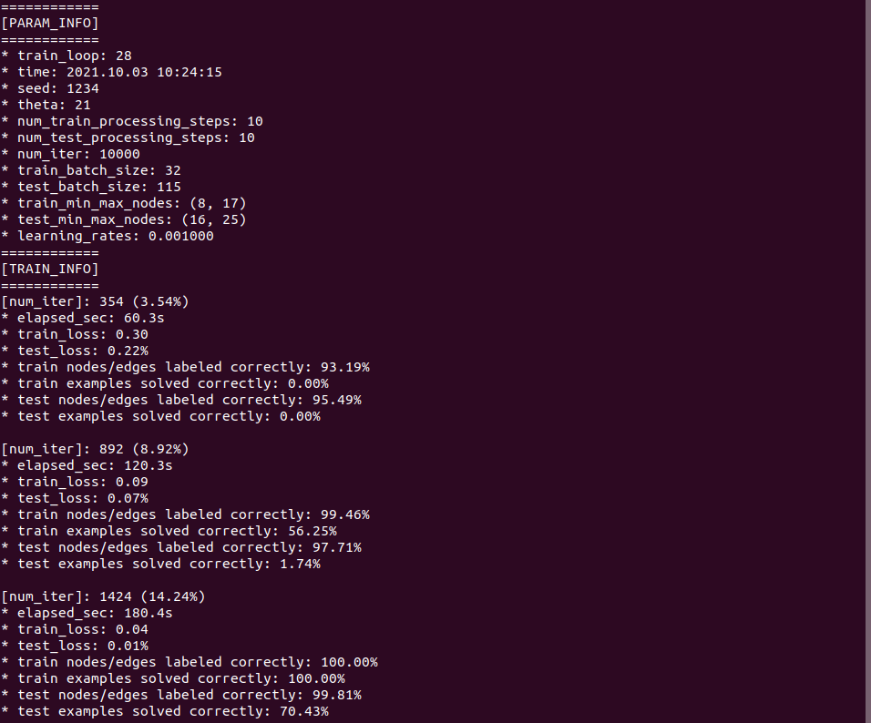
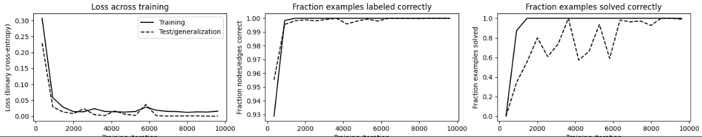
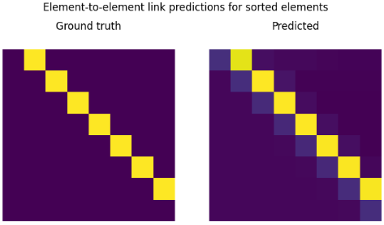

# Graph Neural Network for finding the shortest path with A*

This repository houses the code for "Graph Neural Network for finding the shortest path". \
In detail, it creates random graphs, and trains a graph network to label the nodes and edges on the shortest path between any two nodes with A* algorithm. Over a sequence of message-passing steps, the model refines its prediction of the shortest path.

</img><br/>

Graph generation and constructing graph neural network is mostly based on [Graph Nets](https://github.com/deepmind/graph_nets) library.

This repository is consisted of 3 parts
  1) Implementation of A* algorithm
  2) Collection of shortest paths
  3) Train & Test a Graph Neural Network that given an initial and goal node, outputs the shortest path

<br>

### A* Search Algorithm

It is an informed search algorithm, as it uses information about the path cost and also uses heuristics to find the solution. 
A* achieve optimality and completeness, two valuable property of search algorithms.

Each time A* enters a node, it calculates the cost, f(n)(n being the neighboring node), to travel to all of the neighboring nodes, and then enters the node with the lowest value of f(n).
These values we calculate using the following formula:
f(n) = g(n) + h(n)

</img><br/>

<br>

### Graph Network

The following code constructs a simple graph net module and connects it to data.
``` Python 
import graph_nets as gn
import sonnet as snt

# Provide your own functions to generate graph-structured data.
input_graphs = get_graphs()

# Create the graph network.
graph_net_module = gn.modules.GraphNetwork(
    edge_model_fn=lambda: snt.nets.MLP([32, 32]),
    node_model_fn=lambda: snt.nets.MLP([32, 32]),
    global_model_fn=lambda: snt.nets.MLP([32, 32]))

# Pass the input graphs to the graph network, and return the output graphs.
output_graphs = graph_net_module(input_graphs)
```
In detail, the exact model used is called EncodeProcessDecoder.
1) An "Encoder" graph net, which independently encodes the edge, node, and global attributes (does not compute relations etc.).
2) A "Core" graph net, which performs N rounds of processing (message-passing) steps. The input to the Core is the concatenation of the Encoder's output and the previous output of the Core (labeled "Hidden(t)" below, where "t" is the processing step).
3) A "Decoder" graph net, which independently decodes the edge, node, and global attributes (does not compute relations etc.), on each message-passing step.

</img><br/>

The model is trained by supervised learning. Input graphs are procedurally generated, and output graphs have the same structure with the nodes and edges of the shortest path labeled (using 2-element 1-hot vectors). We could have predicted the shortest path only by labeling either the nodes or edges, and that does work, but we decided to predict both to demonstrate the flexibility of graph nets' outputs.

<br>

### Training Loss
``` Python 
def create_loss(target, outputs):
    losss = [
        tf.compat.v1.losses.softmax_cross_entropy(target.nodes, output.nodes) + tf.compat.v1.losses.softmax_cross_entropy(target.edges, output.edges)
        for output in outputs
    ]

    return tf.stack(losss)
```

The training loss is computed on the output of each processing step. The reason for this is to encourage the model to try to solve the problem in as few steps as possible. It also helps make the output of intermediate steps more interpretable.

<br>

### Set-up

Installation of dependencies:
* First, run ``` pip3 install -r requirements.txt ```
* Next, in ``` main.py ``` tweak the parameters for the training. The default values are as below:
  
  ``` 
  SEED = 1234
  theta = 20  # Try 20-60 for good non-trees. Large values (1000+) make trees. 
  num_nodes_min_max = (10, 15)
  
  num_processing_steps_tr = 10
  num_processing_steps_ge = 10

  num_training_iterations = 30000
  batch_size_tr = 32
  batch_size_ge = 100
  
  num_elements_min_max_tr = (8, 17)
  num_elements_min_max_ge = (16, 33)
  
  learning_rate = 1e-3
  optimizer = snt.optimizers.Adam(learning_rate)
  ```

To run, simply execute ``` python3 main.py ```. This will, by default, start training the graph neural network with the graph dataset which the labels is obtained from the A* algorithm.

</img><br/>

<br>

### Results 

</img><br/>
</img><br/>

<br>

### Errors & Warnings
> 1. Could not load dynamic library 'libcublas.so.10'; dlerror: libcublas.so.10: cannot open shared object file: No such file or directory;
> https://www.tensorflow.org/install/gpu https://stackoverflow.com/questions/63199164/how-to-install-libcusolver-so-11

<br>

### References
[1] Battaglia, P. W., Hamrick, J. B., Bapst, V., Sanchez-Gonzalez, A., Zambaldi, V., Malinowski, M., ... & Pascanu, R. (2018). Relational inductive biases, deep learning, and graph networks. arXiv preprint arXiv:1806.01261. \
[2] https://github.com/deepmind/graph_nets \
[3] https://colab.research.google.com/github/deepmind/graph_nets/blob/master/graph_nets/demos/shortest_path.ipynb \
[4] https://towardsdatascience.com/a-star-a-search-algorithm-eb495fb156bb \
[5] https://www.semanticscholar.org/paper/An-Efficient-Hardware-Architecture-of-the-A-star-Seo-Ok/d503e53acad139da5e03709d4a8087251fb5e023 \
