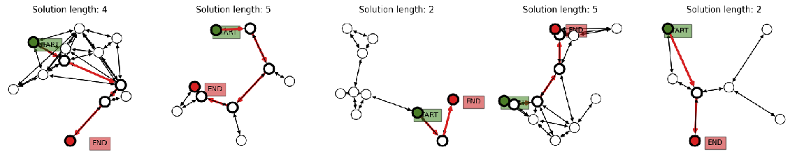

# Graph Neural Network for finding the shortest path

This repository houses the code for "Graph Neural Network for finding the shortest path" 
In detail, it creates random graphs, and trains a graph network to label the nodes and edges on the shortest path between any two nodes with A* algorithm. Over a sequence of message-passing steps, the model refines its prediction of the shortest path.

</img><br/>

Graph generation and constructing graph neural network is mostly based on [Graph Nets](https://github.com/deepmind/graph_nets) library.

This repository is consisted of 3 parts
  1) Implementation of A* algorithm
  2) Collection of shortest paths
  3) Train & Test a Graph Neural Network that given an initial and goal node, outputs the shortest path

### Set-up

Installation of dependencies:
* First, run ``` pip3 install -r requirements.txt ```
* Next, 


To run, simply execute ``` python3 main.py ```. This will, by default, start training the graph neural network with the graph dataset which the labels is obtained from the A* algorithm.

### Results 


### Reference
[1] Battaglia, P. W., Hamrick, J. B., Bapst, V., Sanchez-Gonzalez, A., Zambaldi, V., Malinowski, M., ... & Pascanu, R. (2018). Relational inductive biases, deep learning, and graph networks. arXiv preprint arXiv:1806.01261. \
[2] https://github.com/deepmind/graph_nets \
[3] https://colab.research.google.com/github/deepmind/graph_nets/blob/master/graph_nets/demos/shortest_path.ipynb
